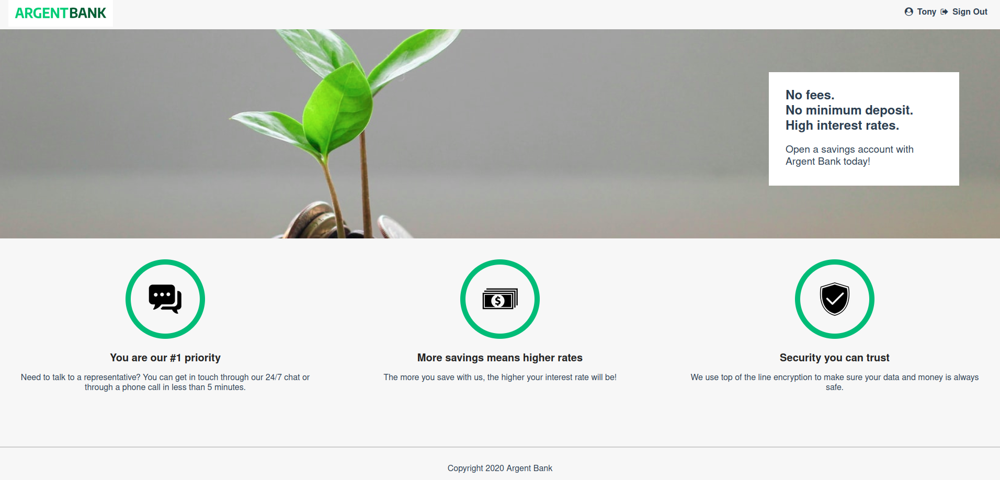

# Argent Bank

## Description
Argent Bank is the number 1 online banking application

## Used Technologies

## Prerequisites

[npm](https://www.npmjs.com/)

## Installation
### API

This project uses an API to operate.

You can find it here: https://github.com/BenjaminSiret/Project-10-Bank-API

Follow the instructions provided in the README file for its installation and start-up.

### FrontEnd

For the frontend installation, follow these steps:

1- fork the project on your GitHub account

2- clone the project on your machine

3- install the dependencies with npm install

4- launch the application with npm start

5- by default, the application runs on the port http://localhost:3000/
